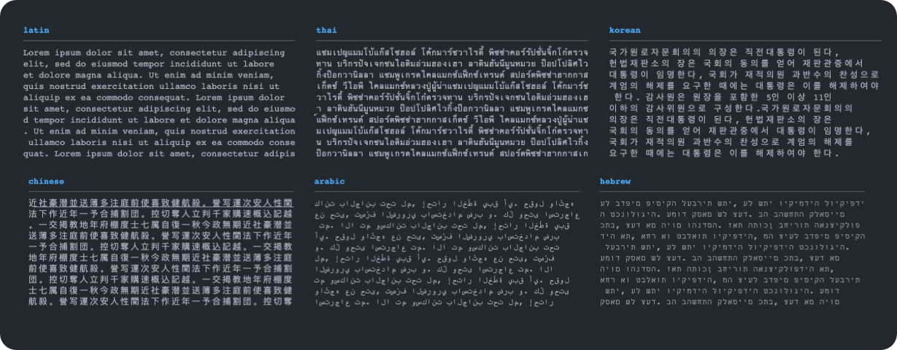

# TextBox

[](https://github.com/FedeClaudi/TextBox.jl/actions/workflows/CI.yml?query=branch%3Amain)
[](https://codecov.io/gh/FedeClaudi/TextBox.jl)


Reshape a text (string, or multi-line string) to have a selected width. 
There's other Julia packages that do this, like [TextWrap.jl](https://github.com/carlobaldassi/TextWrap.jl), but `TextBox.jl` can also handle alphabets with non-standard unicode characters (e.g. characters with width > 1 and right-to-left languages).

Installation
```
] add TextBox
```

Usage:

```Julia
using TextBox

lorem = "Lorem ipsum dolor sit amet, consectetur adipiscing elit, sed do eiusmod tempor incididunt ut labore et dolore magna aliqua. Ut enim ad minim veniam, quis nostrud exercitation ullamco laboris nisi ut aliquip ex ea commodo consequat. "
reshape_text(lorem, 31)
```

